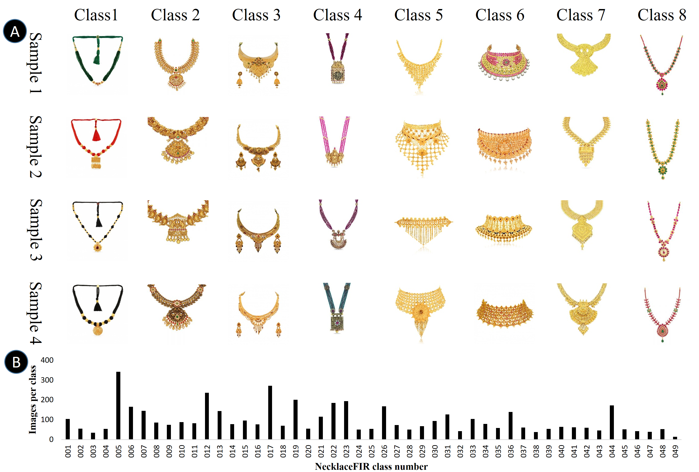

### Publication
Islam, S.M., Joardar, S., Sekh, A.A. (2022). NecklaceFIR: A Large Volume Benchmarked Necklace Dataset for Fashion Image Retrieval. In: Sk, A.A., Turki, T., Ghosh, T.K., Joardar, S., Barman, S. (eds) Artificial Intelligence. ISAI 2022. Communications in Computer and Information Science, vol 1695. Springer, Cham. https://doi.org/10.1007/978-3-031-22485-0_17

### Dataset Description
We have collected an ornament dataset of golden Necklaces. It contains over 4.8k high-resolution golden earring images from different jewellery chain catalogues. These images are also used in online shopping apps.

### License

Copyright © 2022 Sk Maidul Islam

The content of this repository is bound by the following licenses:

- The documents and data are licensed under the MIT license.

 
